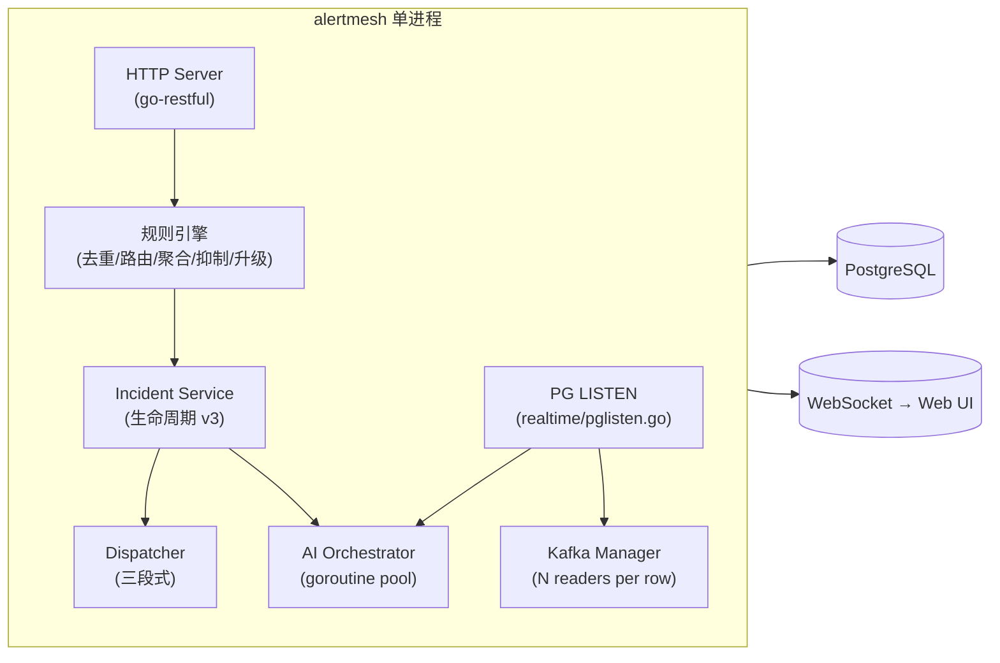

# ARCHITECTURE — 一页纸索引

AlertMesh 是**单进程 Go 二进制**：HTTP Server、规则引擎、AI Worker pool、Kafka
Reader、PG LISTEN 都在同一进程内做受管 goroutine，依赖 PostgreSQL 作为唯一
必选存储。本文不复述细节，只给出"看哪里"的导航。

## 关键决策一句话版

| 决策 | 原因 | 文档 |
|------|------|------|
| 单进程 + goroutine pool | 部署简单，避免 Redis / Kafka / 任务队列的强依赖 | [docs/architecture.md](docs/architecture.md) |
| 规则引擎纯内存 | 对齐 Alertmanager，启动加载 + PG NOTIFY 热更新 | [docs/data-flow.md](docs/data-flow.md) |
| Kafka 由 `data_sources` 行驱动 | 杜绝业务轮询，一切 CRUD 经 `pg_notify('data_source_event')` 亚秒级热加载 | [docs/data-sources.md](docs/data-sources.md) |
| AI 任务用 PG LISTEN/NOTIFY | 不引入 Redis Stream，复用既有 PG 通道；ReAct Agent 通过 langchaingo 驱动 | [docs/ai.md](docs/ai.md) |
| RBAC 用 gorbac + endpoint 自动同步 | 接口权限即按钮权限，前端不再单独维护菜单/按钮表 | [docs/permissions.md](docs/permissions.md) |
| Incident 生命周期 v3 | 1/3/5min 线性递增 + 1h 升级阶梯 P3→P0；resolved 后复现仍告警 | [docs/lifecycle.md](docs/lifecycle.md) |
| Dispatcher 三段式 | resolveRecipients → groupByChannelTarget → dispatchBuckets，按通道合并 | [docs/lifecycle.md](docs/lifecycle.md) §通知 |

## 入口与目录

| 类别 | 位置 |
|------|------|
| 进程入口 | [`cmd/alertmesh/main.go`](cmd/alertmesh/main.go) |
| Wire 依赖注入 | [`cmd/alertmesh/wire.go`](cmd/alertmesh/wire.go) / [`providers.go`](cmd/alertmesh/providers.go) |
| HTTP 路由 | [`internal/router/`](internal/router) |
| 接入归一化 | [`internal/ingestion/`](internal/ingestion) |
| 规则引擎 | [`internal/engine/`](internal/engine) |
| Incident 生命周期 | [`internal/incident/`](internal/incident) |
| AI 编排 | [`internal/ai/`](internal/ai) |
| 通知分发 | [`internal/notification/`](internal/notification) |
| RBAC | [`internal/auth/`](internal/auth) + [`internal/label/`](internal/label) |
| GORM 模型 | [`internal/model/`](internal/model) |
| Realtime（PG LISTEN / WebSocket） | [`internal/realtime/`](internal/realtime) |
| 数据库迁移 | [`migrations/`](migrations)（编号顺延，不修改历史文件） |
| 前端 | [`web/`](web)（React + Ant Design） |

## 新人 onboarding 30 分钟路线

1. 跑通 `make build && make test && make lint`，确认本机环境 OK。
2. 读 [`README.md`](README.md) 的 Quick Start，把后端跑起来。
3. 读 [`docs/architecture.md`](docs/architecture.md) 的"内存状态模型与 HA"小节
   （5 分钟），知道为什么默认不需要 Redis。
4. 读 [`docs/data-flow.md`](docs/data-flow.md) 一图，理解 RawAlert →
   AlertGroup → Incident 的链路。
5. 选一个数据源 kind 跟读：
   [`internal/ingestion/kafka_filter.go`](internal/ingestion/kafka_filter.go) →
   [`internal/ingestion/kafka_manager.go`](internal/ingestion/kafka_manager.go) →
   [`internal/engine/pipeline.go`](internal/engine/pipeline.go) →
   [`internal/incident/service.go`](internal/incident/service.go)。
6. 想动手：先看 [`CONTRIBUTING.md`](CONTRIBUTING.md) 的 PR Checklist。

> 这页纸故意保持很短：所有真细节都在 `docs/` 与代码里。如果你发现这里某个
> 链接走不通或结论与代码不符，请在 PR 里同步把它修正。
