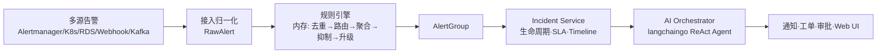

# AlertMesh

> 多源告警聚合 · 智能根因分析 · 全链路事件管理平台

AlertMesh 是一个**多源告警聚合与智能分发平台**，定位为**被动接收器**：

- 统一接收来自 Alertmanager、Prometheus、Webhook、Kafka、K8s Events、OpenSearch /
  Elastic、云监控等**已触发的告警**；
- **不执行** PromQL / KQL 规则评估——规则引擎仅处理入站告警的 labels / annotations；
- 参考 Alertmanager 的内存状态模型实现去重与聚合，**默认无需 Redis / Kafka
  作为基础设施**，预留扩展接口；
- 借助 [langchaingo](https://github.com/tmc/langchaingo) 驱动 AI 对 Incident 进行
  自动根因分析；
- 使用 [gorbac](https://github.com/mikespook/gorbac) 实现 RBAC，**接口权限即按钮
  权限**，前后端复用同一份 identity。



## 核心能力

| 能力 | 说明 |
|------|------|
| **多源接入** | Alertmanager v1/v2、Prometheus 直推、通用 Webhook（RFC 9421 签名）、Kafka、K8s Events、OpenSearch / Elastic、云监控 |
| **告警归一化** | 各来源格式统一映射为 `RawAlert`，Kafka mapping 支持 gjson 路径与 `expr:` 表达式双语法 |
| **规则引擎** | 内存实现去重、聚合、抑制、路由、升级，无外部依赖 |
| **Incident 生命周期 v3** | Open → Ack → In Progress → Resolved → Closed，1/3/5min 线性递增 + 1h 升级阶梯 P3→P0 |
| **消息通知策略 v3** | dispatcher 三段式（resolveRecipients → groupByChannelTarget → dispatchBuckets），P0 默认走 SMS / 语音 |
| **AI 根因分析** | langchaingo ReAct Agent，自动调用 metrics / logs / sysinfo / changes / runbook 5 个 Tool，WebSocket 流式推送 |
| **统一权限** | gorbac RBAC，接口权限 = 按钮权限，identity 自动同步到 `endpoints` |
| **认证** | 本地账号、LDAP（含 group → role 映射）、OIDC / SSO |

## Quick Start

```bash
# 1. 准备依赖
docker compose up -d postgres   # 或自备 PostgreSQL 15+

# 2. 配置环境
cp .env.example .env             # 修改 DATABASE_DSN / JWT_SECRET / ENCRYPTION_KEY

# 3. 数据库迁移
make migrate-up

# 4. 跑后端
make run                         # 默认监听 :8080

# 5. 跑前端（另开一个终端）
cd web && pnpm install && pnpm dev

# 6. 首次登录
#    用户名 admin / 密码见 logs（首次启动会输出一次性密码）
```

环境变量最少三项：`ALERTMESH_DATABASE_DSN` / `ALERTMESH_JWT_SECRET` /
`ALERTMESH_ENCRYPTION_KEY`（base64 32 bytes for AES-256）。其余开关详见
[`.env.example`](.env.example)。

容器化与多节点部署：

```bash
docker compose up -d             # 一键拉起 alertmesh + postgres
# 或
helm upgrade --install alertmesh deploy/helm/alertmesh -n alerting
```

## 文档索引

| 主题 | 文档 |
|------|------|
| 整体架构 / HA / 部署拓扑 / 技术选型 | [docs/architecture.md](docs/architecture.md) |
| 告警消息归一化、路由、聚合、抑制、升级 | [docs/data-flow.md](docs/data-flow.md) |
| 告警生命周期 v3 与收敛策略 | [docs/lifecycle.md](docs/lifecycle.md) |
| 数据源详解（Prometheus / Webhook / Kafka / OpenSearch / Elastic / K8s） | [docs/data-sources.md](docs/data-sources.md) |
| 权限模型（gorbac + endpoint 自动同步 + LDAP 组映射） | [docs/permissions.md](docs/permissions.md) |
| AI 编排（langchaingo / ReAct Agent / 5 个 Tool / Memory） | [docs/ai.md](docs/ai.md) |
| GORM 数据模型 | [docs/data-model.md](docs/data-model.md) |
| 目录结构与单进程启动流程 | [docs/directory.md](docs/directory.md) |
| Roadmap（已交付项已勾选） | [docs/roadmap.md](docs/roadmap.md) |

新加入项目？请先看 [`ARCHITECTURE.md`](ARCHITECTURE.md)（一页纸索引），再按需
深入；动手前请阅读 [`CONTRIBUTING.md`](CONTRIBUTING.md)。

## License

MIT License © 2026 AlertMesh Contributors
