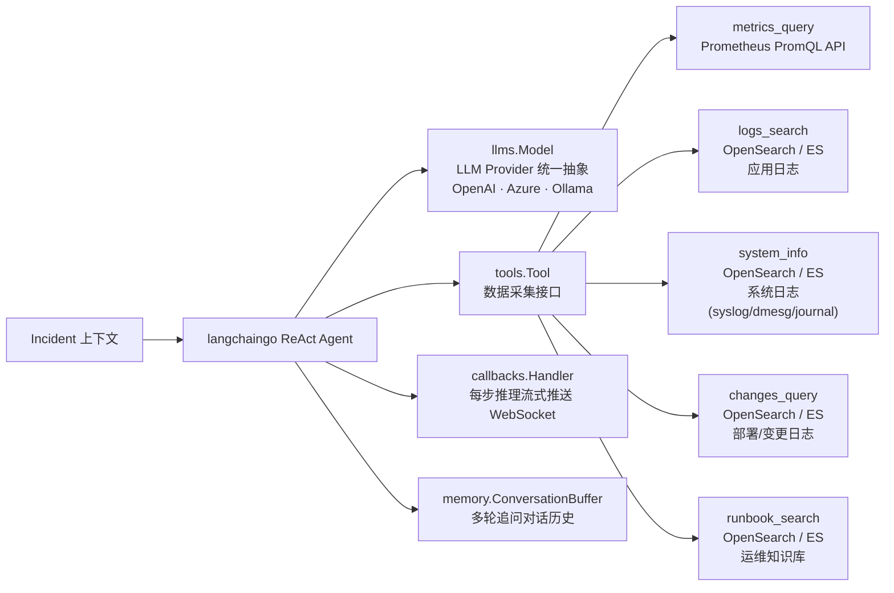

# AI 编排：langchaingo 在 AlertMesh 的位置

langchaingo 是 AI 层的唯一框架，在 5 个位置发挥作用：

| 使用位置 | langchaingo 包 | 作用 |
|---------|--------------|------|
| LLM 抽象 | `llms` | 统一 OpenAI / Ollama / Azure，DB 配置热切换 |
| ReAct Agent | `agents` | Think → Act → Observe 循环，驱动自主分析 |
| Tool Use | `tools` | 数据采集适配器，AI 自主决定查询内容 |
| Callbacks | `callbacks` | 每步推理实时流推 WebSocket，前端可见思考过程 |
| Memory | `memory` | 多轮追问对话历史，按 Incident 隔离 |

## 多工具编排：Prometheus、OpenSearch、K8s Event、Pod 指标

### 是否会「串联多工具」同时分析？

- **会用多个工具，但不是代码里写死的固定流水线，也不是对 Prom 与 OS 的并发 HTTP。** 根因分析走 **ReAct**（`Thought` → `Action` → `Observation`），由 **模型每轮选一个工具** 调用；[`internal/ai/agent.go`](../internal/ai/agent.go) 里建议顺序为 `metrics_query` → `logs_search` → `system_info` → `changes_query` → `runbook_search`，**仅为提示，非强制**。
- **典型实现上每次 `Action` 只执行一次工具调用**（langchaingo 行为），因此 **不是** 在同一时刻对 Prometheus 与 OpenSearch **并行**各发一条请求；模型可在多轮中交替查询，语义上仍可对「指标 + 日志」做联合判断。

### Prometheus 与 Pod CPU / MEM

- 仅通过 **`metrics_query`** 调 Prometheus HTTP API（[`internal/ai/tools/metrics.go`](../internal/ai/tools/metrics.go)）。
- Pod / 容器 **CPU、内存** 依赖集群里是否暴露对应指标（如 `container_cpu_usage_seconds_total`、`container_memory_working_set_bytes` 等，以实际采集为准）；由模型 **编写 PromQL**。**没有**名为「pod_metrics」的独立工具。

### OpenSearch 与「多条工具」的关系

- **`logs_search`** 直接查 OpenSearch（[`internal/ai/tools/logs.go`](../internal/ai/tools/logs.go)）。
- **`system_info` / `changes_query` / `runbook_search`** 在 [`internal/ai/tools/registry.go`](../internal/ai/tools/registry.go) 中复用 **同一个** `LogsTool` 实例，仅查询意图/说明不同，底层仍是一次次 OpenSearch 检索。

### K8s Event

- **没有** 读取 Kubernetes API Server（如 `Event` 资源）的专用工具。
- 若将 Event **以日志形式写入 OpenSearch**（例如索引 `k8s-events-*`），只能通过 **`logs_search` 的 query** 检索；是否命中 Event、是否按 Pod 过滤，取决于 **模型写的 query** 与 **索引字段**，AlertMesh **不会**自动替你做 Event 专用查询。

### 环境变量前提

- AI 工具使用 `envconfig` 前缀 **`ALERTMESH`**：`ALERTMESH_PROMETHEUS_URL`、`ALERTMESH_OPENSEARCH_URL`（见 [`internal/config/config.go`](../internal/config/config.go)）。未配置时对应工具会返回未配置提示。

## 触发链路

**何时写入 `ai_tasks`**

- **自动**：仅当事件来自已开启 `ai_enabled` 的日志类数据源（Kafka / OpenSearch / Elasticsearch），**且**该数据源勾选了 `ai_auto_trigger`（默认关闭）时，`incident.Service` 在**新建** incident 后才会 `enqueueAITask`。
- **手动**：任意时刻由操作员在事件详情点击「触发 AI 分析」或调用 `POST /api/v1/ai/incidents/{id}/trigger`（仍受 `ai_enabled` + kind 白名单约束）。

**任务执行**

1. 入队时写入 `ai_tasks`（`status=pending`）并 `SELECT pg_notify('ai_task_ready', task_id)`。
2. `ai.Orchestrator` 的 worker pool 监听 `LISTEN ai_task_ready`：拿到 task → 装载
   incident 及其关联 `alerts`（分析 prompt 中的 Alert Details 会按时间顺序拼接多条告警，总长度有 rune 上限）→ 通过 langchaingo Agent 调用 LLM + Tools → 结果写回 `ai_analyses`。
3. `ai.Orchestrator` 通过 `WSHub.Broadcast(incidentID, …)` 把每一步推理实时推到前端
   AI 分析面板（`/api/v1/ai/incidents/{id}/ws`）。
4. 完成后回调 `incident.Service.DispatchAIFollowup`：根据 `notification_policies.ai_followup_*`
   字段，按通知策略发一条 AI 总结到对应渠道。

## 多轮追问

前端的 AI 聊天框走 `POST /api/v1/ai/incidents/{id}/chat`，AlertMesh 用
`memory.ConversationBuffer` 按 incidentID 维护对话窗口，并在 prompt 里嵌入截断过的
"上一轮根因分析"作为上下文。详见 [`internal/ai/agent.go`](../internal/ai/agent.go)。
