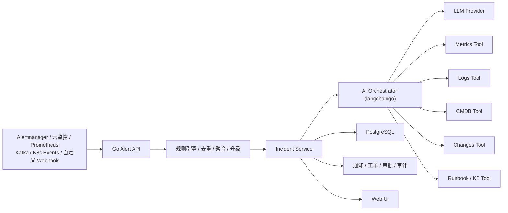
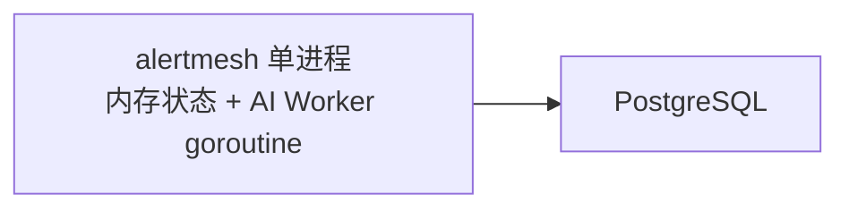
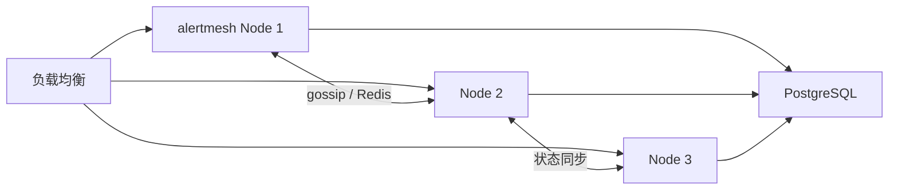
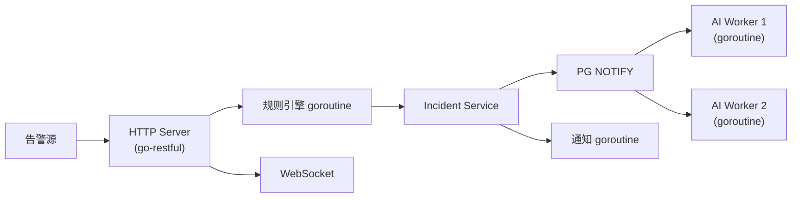
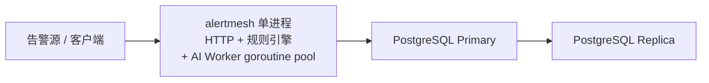
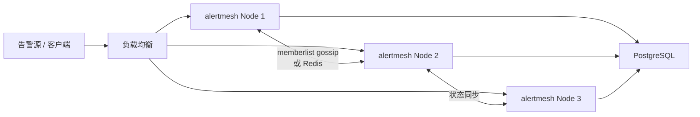

# 整体架构

## 单进程模型

只启动一个二进制 `alertmesh`，HTTP Server、规则引擎、AI Worker goroutine pool 全部
运行在同一进程中，类似 nginx 的 master/worker 模式，但基于 Go goroutine 实现。

> **默认只需 PostgreSQL**（通过 GORM 访问）。规则引擎热路径在进程内存，AI Worker
> 以 goroutine pool 运行在同一进程，通过 PostgreSQL `LISTEN/NOTIFY` 分发任务。
> Redis 预留扩展接口（`ALERTMESH_REDIS_ENABLED=true` 开启）；Kafka 消费链路由
> `data_sources` 表的行驱动，**无 env 开关**——表里有行就启 Reader，没行就空跑
> （PG LISTEN + 5 分钟 reload floor 的固定开销可忽略）。alertmesh 仅作消费者，不向
> Kafka 写消息，无 producer / sink 路径。

## 内存状态模型与 HA

### 默认方案对比（无 Redis）

| 功能 | Alertmanager 方案 | AlertMesh 默认方案 | 启用 Redis 后 |
|------|------------------|-------------------|--------------|
| 指纹去重 | 内存 map + timer | `sync.Map` + TTL goroutine | Redis SETNX TTL |
| 聚合窗口 | 内存 map + timer | `time.AfterFunc` | Redis Hash + Lua |
| 通知去重 | 内存 + nflog | 内存 + `notification_log` | Redis + 表双写 |
| 限流 | 无 | `x/time/rate` 进程内 | Redis 滑动窗口 |
| 任务队列 | N/A | PostgreSQL LISTEN/NOTIFY | Redis Stream（可选替换） |

### 单节点 vs 多节点 HA

与 Alertmanager 相同：单节点无外部状态依赖；多节点通过 gossip（memberlist）同步，
或启用 Redis 后以 Redis 为共享状态，二者任选其一。

## 部署架构

### 单进程内部结构

一个 `alertmesh` 二进制启动后，内部由主 goroutine 运行 HTTP Server，规则引擎、
AI Worker、通知发送、Kafka Consumer、K8s Informer 等均为受管 goroutine，共享同一
进程的内存空间。

### 单节点部署（Phase 1，默认）

### 多节点 HA（Phase 4）

**资源估算（中等规模：每日 10k 告警）**

| 组件 | 规格 | 说明 |
|------|------|------|
| alertmesh | 1×4C8G（单节点）/ 3×4C8G（HA） | HTTP + 规则引擎 + AI Worker 同进程 |
| PostgreSQL | 1×4C16G + 1 从库 | |
| Redis（可选） | 3 节点 1C2G | Phase 3 扩展 |

## 技术选型

| 层次 | 技术 | 说明 |
|------|------|------|
| 后端语言 | Go 1.22+ | |
| Web 框架 | go-restful | REST API，Swagger 自动生成 |
| RBAC | gorbac | 角色继承、权限校验、热更新 |
| AI 框架 | langchaingo | LLM 抽象 / ReAct Agent / Tool Use / Callbacks / Memory |
| LLM Provider | OpenAI / Azure / Ollama | DB 配置运行时热切换 |
| ORM | GORM + pgx driver | `gorm.io/gorm` + `gorm.io/driver/postgres` |
| DB 迁移 | golang-migrate | SQL 文件版本管理，不使用 AutoMigrate |
| 数据库 | PostgreSQL 15 | 唯一必选存储，JSONB + LISTEN/NOTIFY |
| 配置读取 | godotenv/autoload + envconfig | 自动加载 .env，envconfig 绑定结构体 |
| 日志 | zerolog | 结构化 JSON，零分配，支持 pretty 开发模式 |
| 加密 | AES-256-GCM | 敏感配置加密（DB 存储） |
| 进程内限流 | golang.org/x/time/rate | 默认方案，启用 Redis 后可替换 |
| K8s 集成 | client-go | Events Informer |
| 认证 | go-ldap / coreos/go-oidc / JWT | |
| HA 集群（可选） | hashicorp/memberlist | gossip 状态同步，同 Alertmanager |
| Redis（可选，Phase 3） | go-redis/v9 | 分布式限流 / HA 状态 |
| Kafka（可选，Phase 3） | segmentio/kafka-go | 高吞吐告警接入 |
| 前端 | React + TypeScript + Ant Design Pro | |
| 实时推送 | gorilla/websocket | AI 分析流式输出 |
| 可观测性 | Prometheus + OpenTelemetry | |
| 部署 | Docker + Kubernetes + Helm | |

## 模块划分速览

更细的模块说明（接入层、规则引擎、AI 编排层、配置/日志/ORM、用户与认证、系统配置、
告警中心、存储层）请见 [模块设计](modules.md)。
