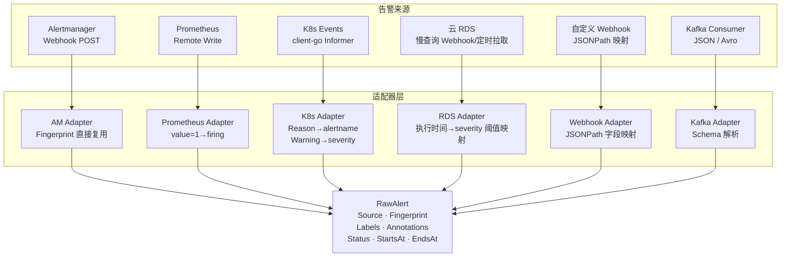
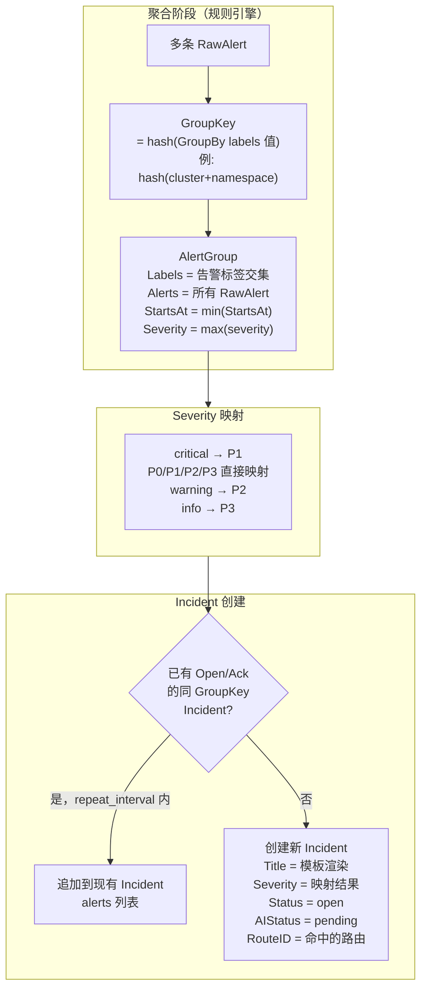
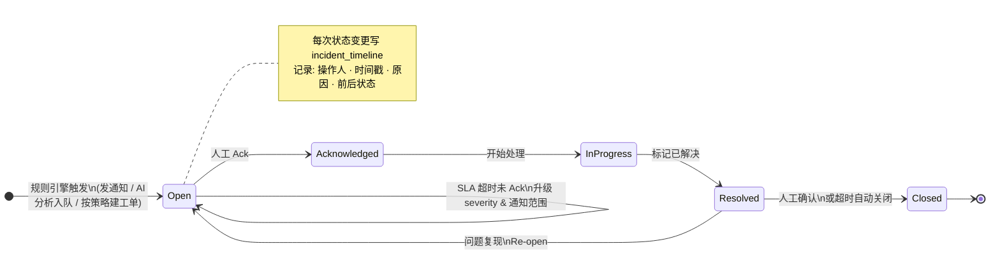

# 告警消息模型映射与流转

> 本文档对应原 README 第 3.1–3.5 节，描述 RawAlert 归一化、AlertGroup 聚合、
> Incident 状态流转。生命周期与收敛策略 v3 见 [lifecycle.md](lifecycle.md)；
> 各数据源的接入实现与字段映射 DSL 见 [data-sources.md](data-sources.md)。

## 1. 整体归一化流程



## 2. 统一告警模型

```go
type RawAlert struct {
    Source      string            // alertmanager / prometheus / k8s / cloud-rds / kafka / webhook
    Fingerprint string            // 去重键：优先使用来源指纹，否则 SHA256(sorted labels)
    Labels      map[string]string // 必含 alertname / severity / source
    Annotations map[string]string // summary / description / runbook_url
    StartsAt    time.Time
    EndsAt      *time.Time        // nil 表示仍在 firing
    Status      string            // firing / resolved
    RawPayload  json.RawMessage   // 保留原始 Payload（审计用）
}
```

**Labels 约定字段**：

| 字段 | 必填 | 说明 | 示例 |
|------|------|------|------|
| `alertname` | ✅ | 告警名称 | `HighCPU` / `PodOOMKilled` |
| `severity` | ✅ | 严重程度 | `critical` / `warning` / `info` |
| `source` | ✅ | 来源标识 | `alertmanager` / `k8s` / `cloud-rds` |
| `cluster` | — | 集群名 | `prod-k8s-01` |
| `namespace` | — | K8s 命名空间 | `production` |
| `service` | — | 服务名 | `order-api` |
| `env` | — | 环境 | `production` / `staging` |

## 3. 各来源字段映射

### Alertmanager → RawAlert

| Alertmanager Payload | RawAlert 字段 | 备注 |
|----------------------|--------------|------|
| `alerts[i].labels` | `Labels` | 含 alertname / severity，直接透传 |
| `alerts[i].annotations` | `Annotations` | |
| `alerts[i].status` | `Status` | `firing` / `resolved` |
| `alerts[i].startsAt` | `StartsAt` | |
| `alerts[i].endsAt` | `EndsAt` | 零值时设为 nil |
| `alerts[i].fingerprint` | `Fingerprint` | **直接复用 AM 已计算的指纹，不重算** |
| `"alertmanager"` | `Source` | |

### K8s Events → RawAlert

| K8s Event 字段 | RawAlert 字段 | 备注 |
|---------------|--------------|------|
| `Event.Reason` | `Labels["alertname"]` | |
| `"warning"` | `Labels["severity"]` | 仅处理 Warning 类型 |
| `"k8s"` | `Labels["source"]` | |
| `Event.InvolvedObject.Kind` | `Labels["kind"]` | Pod / Node / Deployment |
| `Event.InvolvedObject.Name` | `Labels["name"]` | |
| `Event.InvolvedObject.Namespace` | `Labels["namespace"]` | |
| `Config.ClusterName` | `Labels["cluster"]` | 来自 alertmesh 环境变量 |
| `Event.Message` | `Annotations["description"]` | |
| `Event.LastTimestamp` | `StartsAt` | |
| `SHA256(sorted labels)` | `Fingerprint` | |

过滤策略：仅处理 `Event.Type == Warning`，支持按 Namespace / Reason / Kind 白名单
过滤，同对象同 Reason 5 分钟内去重。

### 云 RDS 慢查询 → RawAlert

| RDS 字段 | RawAlert 字段 | 备注 |
|---------|--------------|------|
| `"SlowQuery"` | `Labels["alertname"]` | |
| `ExecutionTime > 5s→warning, >30s→critical` | `Labels["severity"]` | 阈值可配置 |
| `"cloud-rds"` | `Labels["source"]` | |
| `DBInstance.DBInstanceId` | `Labels["db_instance"]` | |
| `DBInstance.RegionId` | `Labels["region"]` | |
| `SQLRecord.DBName` | `Labels["database"]` | |
| `DBInstance.Engine` | `Labels["db_engine"]` | mysql / postgres |
| `SQLRecord.SQLText` (截断 500 字符) | `Annotations["description"]` | |
| `SQLRecord.QueryStartTime` | `StartsAt` | |
| `SHA256(db_instance + database + sql)` | `Fingerprint` | |

### 自定义 Webhook → RawAlert

通过页面配置 JSONPath 映射模板：

| 配置项 | 示例值 | 说明 |
|--------|--------|------|
| `alertname_path` | `$.alert_name` | 必填 |
| `severity_path` | `$.level` | 必填 |
| `service_path` | `$.service_name` | 可选 |
| `description_path` | `$.message` | 映射到 Annotations |
| `starts_at_path` | `$.triggered_at` | ISO8601 或 Unix ts |
| `fingerprint_path` | `$.id` | 若来源已有唯一 ID |

缺失必填字段时适配器返回 HTTP 422，拒绝入库。

## 4. RawAlert → AlertGroup → Incident



## 5. Incident 状态流转


