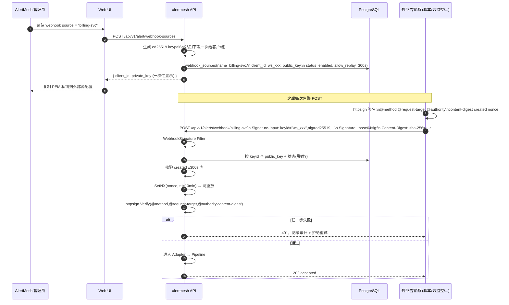
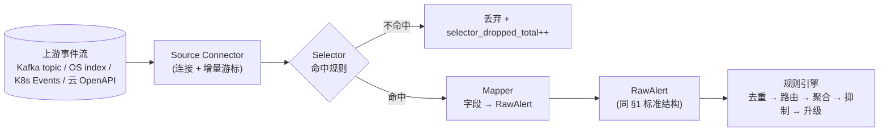
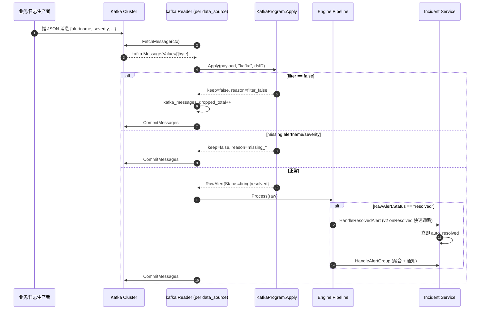

# 告警接入层（数据源详细映射）

> **日志三层降噪（Kafka / OpenSearch / Elastic 与引擎分层）** 见专文
> [log-alert-denoising.md](log-alert-denoising.md)。

> 本文档对应原 README §4.1。接入分为**入站推送**（Alertmanager / Prometheus /
> 第三方 Webhook）和**出站拉取/订阅**（K8s Informer / Kafka Consumer / OpenSearch /
> 云厂商 SDK）两类，鉴权策略由"调用方究竟是谁"决定，**坚决不复用用户登录的
> JWT/Bearer Token**。

## 1. 入站推送 API

```
POST /api/v2/alerts                        # Prometheus 直推（alerting.alertmanagers），无鉴权
POST /api/v1/alerts/alertmanager           # Alertmanager → Webhook Receiver，无鉴权
POST /api/v1/alerts/prometheus/remote      # 兼容路径：Alertmanager-style JSON（非 Remote Write 协议）
POST /api/v1/alerts/webhook/{source}       # 第三方/云监控/自定义，必须 RFC 9421 签名
```

> **Prometheus 直接对接 alertmesh 的标准姿势** 是把 alertmesh 当成 Alertmanager
> 来用——Prometheus 的 notifier 看到 `alerting.alertmanagers.static_configs.targets:[<host:port>]`
> 时，会把 URL 硬编码成 `<host:port>/api/v2/alerts`（默认 v2，可用 `api_version: v1`
> 切回 v1），载荷是一个**裸 JSON 数组**的 `postableAlert` 对象。alertmesh 在
> `internal/router/router.go` 用第二个 WebService 把 `/api/v2` 暴露出来，处理器在
> `internal/ingestion/alertmanager_v2.go`，与 `/api/v1/alerts/alertmanager` 的
> "分组后 webhook"形态**不是一回事**——后者是 Alertmanager 自己往下游 webhook
> receiver 发的 `{status,alerts:[...],groupLabels:{...}}` 包，载荷不一样、用途
> 不一样。
>
> **典型 prometheus.yml 配置**：
>
> ```yaml
> alerting:
>   alertmanagers:
>     - static_configs:
>         - targets: ["192.168.5.134:8080"]   # alertmesh 监听端口
>       # api_version: v2                     # 默认即 v2，可省略
>       # path_prefix: /                      # 默认即 /，无需修改
> ```
>
> 部署后 `tail -f` alertmesh 日志应能看到 `component=ingest source=prometheus-v2
> path=/api/v2/alerts count=N alerts accepted` 这一行；如果完全看不到这条日志，
> 说明请求根本没到 alertmesh（八成是网络层 / Service 端口 / `alerting.alertmanagers.scheme`
> 配置有问题，先排查这一段，再看 adapter）。
>
> **`severity` 标签建议直接写 `P0/P1/P2/P3`**——引擎在聚合阶段会用
> `internal/engine/aggregation.go` 的 `mapSeverity` 把外部值归一化（`critical → P1`、
> `warning → P2`、`info → P3`、未知 → `P3`），而 AlertRoute matcher 走严格相等
> 比较，所以 `severity=critical` 这种 matcher 永远不会命中。配置告警源时直接用
> 归一化后的值能省掉一层认知负担。

| 接入方 | 端点 | Auth 中间件 | 鉴权方式 | 失败响应 | 设计依据 |
|--------|------|------------|---------|---------|---------|
| Prometheus 直推（`alerting.alertmanagers`）| `/api/v2/alerts` | ❌ 不挂 | 网络层（K8s NetworkPolicy / ingress allowlist / mTLS）| 网络拒绝 | Prometheus 的 notifier 不支持签名，Alertmanager v2 PostableAlerts 是它"以为自己在跟谁说话"的契约 |
| Alertmanager（同集群内 AM 进程，下游 webhook）| `/api/v1/alerts/alertmanager` | ❌ 不挂 | 同上 | 网络拒绝 | AM 本身只支持 basic auth，简单且与基础设施职责一致 |
| 通用 Webhook `{source}` | `/api/v1/alerts/webhook/{source}` | ✅ `WebhookSignature` Filter | **HTTP Message Signatures (RFC 9421) + Ed25519**，每个 source 一对独立 keypair | `401`，且 `backoff.Permanent` 风格不重试 | 第三方/外部脚本，可以下发密钥，参考 safety.md 第二部分方案 B |

> **为什么不用 Bearer Token**：用户 JWT 携带的是"人类用户"的身份，过期短、配置在
> 浏览器；而告警源是机器、无人值守、运行在第三方网络。若强制走 JWT 会导致告警在
> Token 过期/签发轮换时全部丢失，且把人类账号变成共享密码。

## 2. 通用 Webhook 的 RFC 9421 签名设计

完全对齐 safety.md 第二部分方案 B（与 Woodpecker `httpsign.Client` 同样的
[`yaronf/httpsign`](https://github.com/yaronf/httpsign) 库），但**方向反过来**：
客户端是外部告警源，alertmesh 是验签端。



**强制覆盖的签名字段**：`@method`、`@request-target`、`@authority`、
`content-digest`、`created`、`nonce`，缺一不可（与 safety.md B.1 一致）。

**密钥与状态表**（落到 alert center 模块，已实现：见
`migrations/000032_create_webhook_sources.up.sql` +
`internal/model/webhook_source.go` +
`internal/router/middleware/webhook_signature.go`）：

```go
type WebhookSource struct {
    ID          string `gorm:"primaryKey;type:uuid;default:gen_random_uuid()"`
    Name        string `gorm:"uniqueIndex;not null"`                 // = path 中的 {source}
    ClientID    string `gorm:"uniqueIndex;not null;type:varchar(64)"` // RFC 9421 keyid (auto "ws_<16hex>")
    PublicKey   string `gorm:"type:text;not null"`                   // PEM Ed25519 PKIX
    AllowSkew   int    `gorm:"not null;default:300"`                 // created ±N seconds
    IsEnabled   bool   `gorm:"not null;default:true"`
    Description string
    LastUsedAt  *time.Time
    Timestamps
}
```

私钥**只在创建/轮换时一次性返回**（管理 API：`POST /api/v1/alert/webhook-sources`、
`POST /api/v1/alert/webhook-sources/{id}/rotate`），不入库；nonce 去重默认走进程内
`sync.Map + TTL`（实现见 `internal/router/middleware/webhook_signature.go` 中的
`nonceCache`），启用 Redis 后可热切到 `SETNX`。

## 3. 出站拉取 / 订阅（AlertMesh 作为 client 端）

K8s Events Informer / Kafka Consumer / OpenSearch / 云厂商 SDK 等，是 alertmesh
主动连接到对方系统拉数据，**鉴权完全由源端决定**，alertmesh 只负责把凭证安全地存
起来 + 用对：

| 渠道 | 客户端库 | 凭证存放 | 凭证内容 |
|------|---------|---------|---------|
| K8s Events | `client-go` Informer | env / DB | in-cluster ServiceAccount Token，或 kubeconfig 路径 |
| Kafka 消费 | `segmentio/kafka-go` | DB（AES-256 加密）| brokers / SASL user / password / TLS CA |
| OpenSearch / ES 拉取 | `opensearch-go` / `go-elasticsearch` | DB（AES-256 加密）| basic auth 或 API key |
| 云厂商监控 SDK | 阿里云 / 腾讯云 / AWS SDK | DB（AES-256 加密）| AccessKey + SecretKey + region |

启停约定：`ALERTMESH_K8S_ENABLED` / `ALERTMESH_OPENSEARCH_ENABLED` 仍是显式
opt-in（默认 false）；Kafka 消费链路**不接受任何 env 控制**（参见 §5），
「要不要消费」完全由 `data_sources` 表中 `kind=kafka & is_enabled=true` 的行
决定——表里有行就启 Reader，没行就空跑；alertmesh 仅作消费者，无 producer / sink
路径。连接参数（除 K8s in-cluster 外）通过 Web UI 录入并加密入库，启动时由
`internal/store` 解密注入到对应客户端。

```mermaid
flowchart LR
    subgraph IN["入站（alertmesh 是 server）"]
        PM["Prometheus\n(alerting.alertmanagers)"] -->|"无鉴权\n网络层兜底"| EP2["/api/v2/alerts\n(PostableAlerts JSON 数组)"]
        AM["Alertmanager\n(下游 webhook)"]          -->|"无鉴权"|              EP1["/api/v1/alerts/alertmanager"]
        EXT["第三方/云监控\n(自有 ed25519 私钥)"]    -->|"RFC 9421 Ed25519\n签名"| FILTER["WebhookSignature Filter\n查 webhook_sources.public_key\n校验 ts/nonce/digest"] --> EP3["/api/v1/alerts/webhook/{source}"]
    end

    subgraph OUT["出站（alertmesh 是 client）"]
        K8S["K8s API Server"]   -->|"ServiceAccount Token"|   ALERT
        KFK["Kafka Cluster"]    -->|"SASL/TLS (DB 加密)"|     ALERT["alertmesh"]
        OS["OpenSearch / ES"]   -->|"basic auth / api-key"|   ALERT
        CLD["云厂商 OpenAPI"]    -->|"AK/SK"|                  ALERT
    end
```

> **注意**：上面只解决 _怎么连得上_。Kafka topic 上跑的不全是告警、OpenSearch
> 索引里 99% 是普通日志、K8s Events 大量是 `Normal` 心跳——必须先 _筛_ 再 _转_
> 才能进 RawAlert。下一节给出统一的 **Selector + Mapper** 配置模型。

## 4. 客户端拉取的 Selector + Mapper

入站推送（§1 / §2）有现成 schema：Alertmanager / Prometheus 直接给出 alerts
数组，第三方 webhook 走 RFC 9421 验签后已经是"承诺为告警"的载荷。**出站拉取（§3）
不一样**——上游的载体是 _通用的事件流_：

| 渠道 | 上游载体 | 噪声占比（典型） | 痛点 |
|------|---------|----------------|------|
| Kafka 消费 | 业务/审计/日志 topic 的 JSON / Avro 消息 | 99%+ | 不能把整 topic 当告警，必须按 `event_type` / `severity` 等字段筛 |
| OpenSearch / ES 拉取 | 索引中的日志文档（应用日志、访问日志、系统日志）| 99%+ | 必须用 DSL/Lucene 命中 ERROR / 关键字，再 cursor 增量拉 |
| **K8s Watch**（Pod / Node / Event 多 sub-kind）| API Server 的 **资源对象状态变化**（Pod 重启、Node NotReady、调度失败 …），不是 `Event` 流 | 极高 | **不能光看 `Event` 对象**——线上最常见的"Pod 重启告警"必须 watch Pod 资源、按 `RestartCount` 增量触发，并主动回查 `Events()` / `Logs()` / `Node` 做 enrichment（[airwallex/k8s-pod-restart-info-collector](https://github.com/airwallex/k8s-pod-restart-info-collector/blob/master/controller.go) 是这一模式的标准实现） |
| 云厂商监控 SDK | 阿里云/腾讯云 OpenAPI 返回的 metric / event 列表 | 50%+ | 不同云字段名差异大，需要厂商专属 mapper |

为此每个客户端拉取源都额外配置一份 **Ingest Source 配置**，三段一体：



完整的 Selector / Mapper DSL、各 connector 的字段示例（Kafka / OpenSearch /
K8s pod_restart / K8s event 兜底）、管理 API 列表（identity = `ingestSource*`）、
Web UI 三段式抽屉、运行时与可观测性（per-source counters、`mapper_error_total`、
背压策略）——全部沿用原 README §4.1.4 的描述，请直接看
[`internal/router/data_sources.go`](../internal/router/data_sources.go) /
[`internal/ingestion/`](../internal/ingestion) 与下面的 Kafka 详尽实现。

## 5. Kafka 数据源（filter 表达式 + 字段映射）

§4 给出了通用模型，下面落到 Kafka 这一具体实现上。Kafka 消费器现在是**真正的
`segmentio/kafka-go` Reader 集群**（[`internal/ingestion/kafka_manager.go`](../internal/ingestion/kafka_manager.go)），
每行 `data_sources` 记录起一个独立的 goroutine + Reader，配置 100% 来自 DB；
`pg_notify('data_source_event')` 让任何 CRUD 都能在亚秒级完成消费器热加载——**与
项目"杜绝任何业务轮询"的方针完全一致**。



> **为什么是 N 个独立 Reader 而不是 1 Reader + N 个 FetchMessage goroutine？**
>
> `segmentio/kafka-go` 的消费者组协议要求每个 partition 在同一时刻只属于一个
> `Reader` 实例：N 个共享同一 `GroupID` 的 Reader 会被 broker **自动均分
> partition**，N 个 worker 各自独立 `FetchMessage` → `Apply` → `CommitMessages`，
> **每个 partition 内的 offset 推进顺序天然保持线性**。共享 1 Reader + 多 goroutine
> 并发 Fetch 反而会让 commit 顺序混乱、被库内部串行化、还可能撞上 `kafka-go` 的
> 内部 mutex——既得不到并发度也丢了 partition 内顺序。
>
> 这种「每行 N workers」模型也意味着对引擎热路径有 race 的潜在风险（dedup /
> router 正则 / per-group_key incident 创建），所以本次重构同时把这三处都改成了
> lock-free 或细粒度锁安全：见 [`internal/engine/dedup.go`](../internal/engine/dedup.go)
> 的 `sync.Map.LoadOrStore + atomic.Int64`、[`internal/engine/routing.go`](../internal/engine/routing.go)
> 的 `SetRoutes` 时一次性预编译所有 IsRegex matcher、[`internal/incident/service.go`](../internal/incident/service.go)
> 的 `groupKeyLocks sync.Map` per-key 串行化。`-race` 跑通后才允许在生产用 N>1。

**配置 schema**（落在 `data_sources.config` jsonb 内）：

```json
{
  "topic": "alerts.raw",
  "group_id": "alertmesh-ingest",
  "max_per_second": 50,
  "consumer_concurrency": 1,
  "filter": "level == 'ERROR' && env in ['prod','pre']",
  "mapping": {
    "alertname":     "alert.name",
    "severity":      "alert.severity",
    "fingerprint":   "alert.id",
    "starts_at":     "ts",
    "summary":       "msg",
    "description":   "stack",
    "labels":        { "service": "svc", "host": "host" },
    "annotations":   { "runbook_url": "runbook" },
    "status_path":   "state",
    "resolved_when": "level == 'INFO'"
  }
}
```

- `filter`：[expr-lang](https://github.com/expr-lang/expr) 布尔表达式；空字符串 = 全部放行。
- `mapping.alertname` / `mapping.severity`：**必填**，路径用 [gjson](https://github.com/tidwall/gjson)
  语法（点分隔；`tags.0` 可索引数组）。
- `mapping.status_path` 命中 `resolved` / `ok` / `recovered` / `cleared`，或
  `mapping.resolved_when` 表达式为 true → 该消息走 v2 lifecycle 的 onResolved
  快速通路（[`internal/engine/pipeline.go::Process`](../internal/engine/pipeline.go)），
  立即归档对应 incident，**无需等待 staleness reaper**。

### 5.1 mapping 双语法：gjson 路径 / `expr:` 表达式（v3）

每一个 string-valued mapping cell（`alertname` / `severity` / `fingerprint` /
`summary` / `description` / `starts_at` / `ends_at` / `status_path`，以及
`labels[*]` / `annotations[*]`）从 v3 起均支持两种语法：

| 语法 | 写法 | 行为 |
| --- | --- | --- |
| **gjson 路径**（默认） | `route_name` / `alert.severity` / `tags.0` | 在 [tidwall/gjson](https://github.com/tidwall/gjson) 路径上做单次 lookup，零分配；与历史所有数据源 100% 兼容 |
| **expr 表达式** | `expr: route_name + "\|" + normalize_path(strip_query(path))` | 在 [expr-lang/expr](https://github.com/expr-lang/expr) VM 中求值，可访问 JSON 顶层任意字段，也可使用以下内置函数 |

- 编译期：[`internal/ingestion/kafka_filter.go::CompileKafkaProgram`](../internal/ingestion/kafka_filter.go)
  检查 `expr:` 前缀，立即编译为 `*vm.Program` 并强制返回值为 string；语法错误立刻
  400 弹回 UI（错误信息形如 `kafka mapping.fingerprint 编译失败：…`）。
- 运行期：[`KafkaProgram.Apply`](../internal/ingestion/kafka_filter.go) 走统一的
  `evalField` 分发，env 在每条消息内**懒构造一次**（`buildEnv`）；filter /
  resolved_when / mapping 共享同一棵 `map[string]any`，所以表达式重的配置依然
  单消息只解析一次 JSON。

#### 内置函数

| 函数 | 签名 | 用途 |
| --- | --- | --- |
| `strip_query(s)` | `(string) → string` | 去掉 `?` 之后的 query string；无 `?` 原样返回，零分配 |
| `normalize_path(s)` | `(string) → string` | 按 `/` 切段，把每段命中以下规则的 id 替换为 `{id}`：UUID v4 / Eth 地址 (`^0x[0-9a-f]{40}$`) / 长 hex (`≥16` 含 `0x` 前缀；`≥32` 裸串) / Base58 (`32–44`) / 纯数字 |
| `regex_replace(s, pattern, repl)` | `(string, string, string) → string` | 任意 RE2 替换；首次编译后进入进程内 LRU 缓存，后续命中零开销 |
| `coalesce(...)` | `(...any) → any` | 选首个非空 / 非 `"-"` / 非 `"null"` 的参数；专为 Higress / Envoy access log 的 `"-"` 占位场景设计 |

> 上述函数同时对 `filter` 和 `resolved_when` 表达式生效，所以也能写
> `filter: 'strip_query(path) != "/healthz"'` 屏蔽健康检查。

#### 安全 filter helper（**强烈推荐**用于排除型表达式）

> ⚠️ **为什么 `level != "DEBUG"` 不可靠**：alertmesh 的 expr 用 `AllowUndefinedVariables()`，
> payload 缺 `level` 字段时表达式求值为 `nil != "DEBUG"` → **true**，整条消息被放行。
> 如果你看到"老系统过滤后只剩 10%，alertmesh 几乎全过"，根因就在这里 —— 旧 DSL 在字段
> 不存在时返回 `false`，alertmesh 原生 expr 返回 `true`。**排除型 filter 一律改用下表的
> `neq()` / `oneof()` / `regex_match()`，字段缺失时它们返回 `false`，与旧 DSL 行为一致。**

| Helper | 签名 | 缺失字段 | 用途 |
| --- | --- | --- | --- |
| `has(path)` | `(string) → bool` | false | path 是否存在 |
| `get(path)` | `(string) → string` | `""` | 读字符串值 |
| `eq(path, v)` | `(string, string) → bool` | false | 存在且字符串相等 |
| `neq(path, v)` | `(string, string) → bool` | **false**（关键差异） | 存在且不等；排除型条件首选 |
| `gt / gte / lt / lte(path, n)` | `(string, number) → bool` | false | 数字比较；自动接受 `"500"` 这种字符串数字 |
| `oneof(path, v1, v2, …)` | `(string, …string) → bool` | false | 字符串值在白名单内（用 `oneof` 是因为 `in` 是 expr 关键字） |
| `regex_match(path, pattern)` | `(string, string) → bool` | false | 正则匹配；与 `regex_replace` 共享缓存（命名为 `regex_match` 是因为 `matches` 是 expr 内置中缀操作符） |
| `not_empty(path)` | `(string) → bool` | false | 非空字符串，剔除 `""` / `"-"` / `"null"` 三种"空"占位 |

第一个参数始终是 **gjson 路径**（与 mapping 字段路径写法完全一致：`labels.namespace`、`tags.0`、`request.headers.x-trace-id`），便于操作员脑里只维护一套 path 语法。

**等价改写示例**：

| 业务意图 | ❌ 不安全（缺字段就放行） | ✅ 安全（缺字段就丢） |
| --- | --- | --- |
| 排除 DEBUG 日志 | `level != "DEBUG"` | `neq("level", "DEBUG")` |
| 只看 P0/P1 | `severity in ["P0","P1"]` | `oneof("severity", "P0", "P1")` |
| 跳过 kube-system 命名空间 | `namespace != "kube-system"` | `neq("namespace", "kube-system")` |
| 5xx 错误 | `status_code >= 500` | `gte("status_code", 500)` |
| 只看 `/api/` 前缀 | `path matches "^/api/"` | `regex_match("path", "^/api/")` |
| 多条件组合 | `level != "DEBUG" && status_code >= 500` | `neq("level","DEBUG") && gte("status_code", 500)` |

> 包含型表达式（`severity == "P0"`、`status_code >= 500`）在原生 expr 下也返回 false 当字段缺失，因此可以继续用原生写法。**只有 `!=` / `not in` / `not matches` 这一类排除条件存在差异。**

> **运维巡检 SQL**（一次性挑出存量数据源里仍在用 `!=` 但没迁移到 `neq(` 的）：
> ```sql
> SELECT id, name, config->>'filter'
> FROM data_sources
> WHERE kind = 'kafka'
>   AND config->>'filter' LIKE '%!=%'
>   AND config->>'filter' NOT LIKE '%neq(%';
> ```

> **性能小贴士**：每个 helper 调用都会做一次 `parsed.Get(path)` 全文扫描。同字段重复访问可以缓存：
> `let v = get("level"); v != "" && v != "DEBUG"` —— `let` 是 expr 原生绑定，比写两次 `get("level")` 多省一次扫描。

> **Web UI 提示**：
> - 数据源详情抽屉里的 "过滤表达式" 输入框只接受 **表达式本体字符串**，不要把整段 `{"filter": "..."}` JSON 包装也粘进去。
> - 如果不小心粘了 JSON 包装，失焦时会自动检测并提取 `.filter` 字段，同时 toast 提示 "检测到 JSON 包装，已自动提取 .filter 字段。"
> - 如果 JSON 不合法或不包含 `filter` 键，输入保持原样、由后端返回友好的中文错误（"检测到表达式以 \`{\` 开头，疑似把 ... 整段 JSON 粘到了表达式框" 等）。
> - 同样的错误翻译也覆盖 `matches(path, pattern)` → `regex_match(path, pattern)`、`in(path, ...)` → `oneof(path, ...)` 这两个常见 expr 关键字冲突。

#### 完整示例：OneKey/Higress 访问日志（v3 单源解决）

```json
{
  "topic": "logging-higress-prod-higress-gateway",
  "group_id": "alertmesh-higress-prod",
  "max_per_second": 200,
  "consumer_concurrency": 4,
  "filter": "response_body != \"-\"",
  "mapping": {
    "alertname":   "route_name",
    "severity":    "expr: response_code >= \"500\" ? \"P2\" : (response_code >= \"400\" ? \"P3\" : \"P3\")",
    "fingerprint": "expr: route_name + \"|\" + normalize_path(strip_query(path))",
    "summary":     "expr: method + \" \" + path + \" -> \" + response_code",
    "description": "response_body",
    "starts_at":   "start_time",
    "labels": {
      "route_name":    "route_name",
      "path_template": "expr: normalize_path(strip_query(path))",
      "method":        "method",
      "code":          "response_code",
      "true_client_ip": "expr: coalesce(true_client_ip, x_forwarded_for, downstream_remote_address)"
    },
    "annotations": {
      "request_id":  "request_id",
      "cluster":     "kubernetes.labels.higress",
      "upstream":    "upstream_host"
    }
  }
}
```

行为对照（同一 sample 三种变体，断言 fingerprint 相同 → 折叠为同 incident，
对应 [`internal/ingestion/kafka_filter_test.go::TestExprFingerprintHigress`](../internal/ingestion/kafka_filter_test.go)）：

| Kafka path | 计算结果 |
| --- | --- |
| `/wallet/v1/proxy/network` | `wallet.onekeycn.com\|/wallet/v1/proxy/network` |
| `/wallet/v1/proxy/network?source=app&v=2` | `wallet.onekeycn.com\|/wallet/v1/proxy/network`（query 被 `strip_query` 去掉） |
| `/wallet/v1/users/12345/profile` | `wallet.onekeycn.com\|/wallet/v1/users/{id}/profile`（`12345` 被 `normalize_path` 规整）|

### 5.2 字段映射详解 / 端到端配置 / 通知正文渲染

完整的字段语义（`alertname` / `severity` / `summary` / `description` / `starts_at` /
`ends_at` / `fingerprint` / `status_path` / `resolved_when` / `labels` / `annotations` /
`filter` / `consumer_concurrency`），9 步 Web UI 配置流程，以及 IM/邮件渲染的五段
式通知正文规则（`buildNotificationBody`）请参考：

- [`internal/ingestion/kafka_filter.go`](../internal/ingestion/kafka_filter.go) ——
  `KafkaMapping` 结构 + `KafkaProgram.Apply` 执行流；
- [`internal/router/data_sources.go`](../internal/router/data_sources.go) ——
  CRUD + `validateConsumerConcurrency` + dry-run 端点；
- [`internal/incident/service.go::buildNotificationBody`](../internal/incident/service.go) ——
  五段式正文（表头 / summary / 维度 labels / 上下文 annotations / 详情）。

### 5.3 热加载契约

- UI 修改 datasource → `internal/router/data_sources.go` 的 Create/Update/Delete/SetDefault
  落库后调 `pg_notify('data_source_event', ...)`；
- `KafkaManager.Start()` 启动时通过 [`internal/realtime/pglisten.go`](../internal/realtime/pglisten.go)
  起一条独占连接 LISTEN 同名 channel；
- 收到事件 → debounce 500ms → `Reload()` 拉表 + diff `configHash` → 新增/变更/
  删除的 reader 分别 spawn / restart / cancel，旧 reader 的 goroutine 在 2s 内
  退出后释放 broker 连接；
- **5 分钟 floor**：兜底兜底再兜底——如果 LISTEN 连接重连期间错过了 NOTIFY，
  最多 5 分钟后必然完成一次 Reload。这是**对自身配置表的健康保险**，不是业务
  数据轮询。

### 5.4 Prometheus 指标

```
alertmesh_kafka_messages_received_total{datasource}
alertmesh_kafka_messages_dropped_total{datasource, reason="filter_false|missing_alertname|missing_severity|bad_json|filter_error|mapping_error"}
alertmesh_kafka_consumer_lag{datasource, partition}
```

> **注意**：以上指标只覆盖 **filter / mapping 阶段**的丢弃。一条消息**通过 filter +
> mapping** 后还要进引擎的 **dedup → silence → routing → aggregation → inhibition**
> 五道关，任何一关丢了都不会回到 kafka 计数器。引擎层的 drop 走
> `alertmesh_pipeline_dropped_total{reason="dedup|silence|inhibit"}`，
> dedup drop 同时打 `engine.duplicate alert dropped` 日志（带
> `source` / `fingerprint` / `data_source_id`），可以 grep 自己的 ds 名快速
> 定位"消息进来了但被折叠了多少"。

#### 5.4.1 fingerprint 折叠陷阱（常见误判）

**症状**：filter 表达式看起来"会命中大量消息"，但 incident 数量长期停在 1～
几个，UI 上像是"kafka 没消费"。

**根因**：dedup 默认 5 分钟 TTL（[`internal/engine/dedup.go::defaultDedupTTL`](../internal/engine/dedup.go)），
窗口内**同一 fingerprint 只有第一条往下走**，剩下全部 `pipeline.Process` 入口
处 dedup drop。窗口过期后再来同 fingerprint 的告警，仍会落到**同一个 group_key
对应的、那条已 OPEN 的 incident**，只做 firing_count++，**不会新建第二个
incident**。

**典型坑**：Higress 访问日志 `expr: route_name + "|" + normalize_path(strip_query(path))`
这种 fingerprint，对一个真实业务网关 cardinality 通常只有几十——意味着**最多
几十个 incident**，无论流量多大。

**确认方法**：

```bash
# alertmesh 进程的 stderr/log 里 grep
grep 'duplicate alert dropped' alertmesh.log | grep <你的 ds 名>
# 或看 metric
curl -s :8080/metrics | grep 'pipeline_dropped_total{reason="dedup"}'
```

**解法（按需选一）**：

| 想要的行为 | mapping.fingerprint 怎么写 |
| --- | --- |
| 按响应码维度拆开（5xx / 4xx / 2xx 各自 incident） | `expr: route_name + "\|" + normalize_path(strip_query(path)) + "\|" + response_code` |
| 按客户端 IP 拆开（攻击溯源场景） | `expr: route_name + "\|" + normalize_path(strip_query(path)) + "\|" + coalesce(true_client_ip, x_forwarded_for)` |
| 按上游实例拆开（定位单实例问题） | `expr: route_name + "\|" + upstream_host` |
| 完全按 labels 自然区分（cardinality 由 mapping.labels 决定） | 留空（fallback 到 `ComputeFingerprint(labels)`） |
| 真的就是想"每条消息一个 incident"（不推荐，会立刻被告警风暴淹掉） | `request_id` 或类似全局唯一字段 |

**反面建议**：在没想清楚 cardinality 之前不要直接挂 `request_id`。一个 1k QPS 的
Higress 网关，5 分钟内会产生 30 万个 incident、30 万次通知派发——任何 IM
通道都会立刻被限流，PostgreSQL 也会被 incident_event 写穿。**fingerprint 的
cardinality 才是告警系统真正的"音量旋钮"**。

### 5.5 测试一条样例消息（dry-run）

```bash
curl -X POST http://localhost:8080/api/v1/data-sources/$DS_ID/test-message \
  -H 'Content-Type: application/json' \
  -d '{"sample":"{\"alertname\":\"DiskHigh\",\"severity\":\"P3\"}"}'
```

返回 `{kept, drop_reason?, raw_alert?, debug:{filter_eval,resolved,mapping_resolved}}`，
**不会落库**——纯 dry-run，操作员可以在保存前反复迭代 filter 表达式与字段映射。
