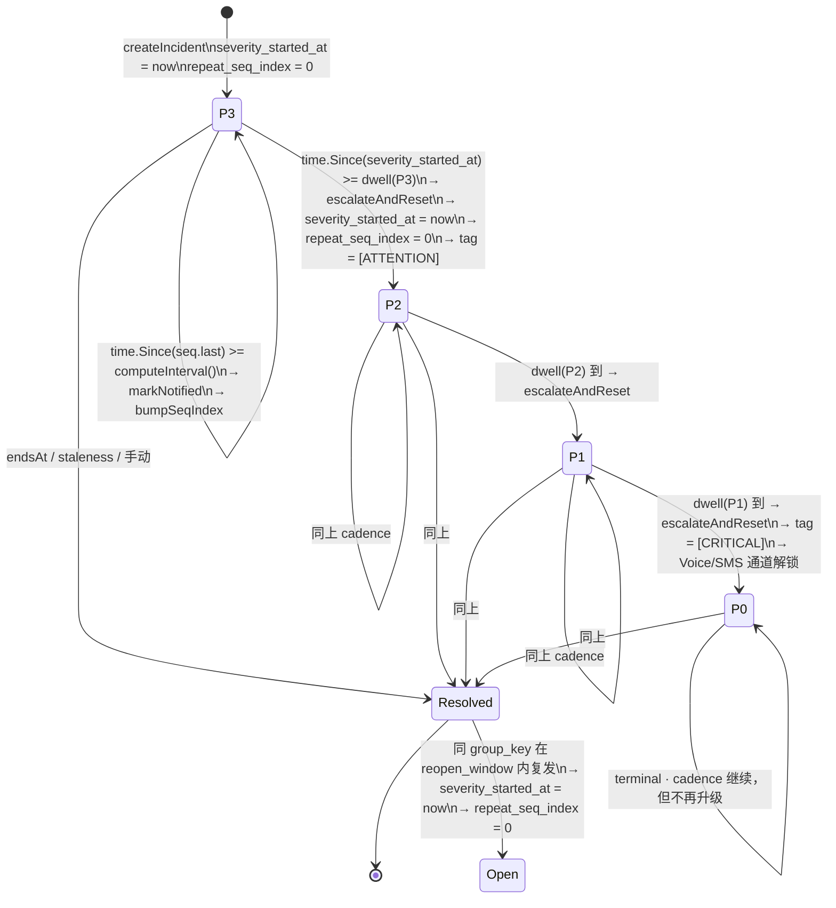
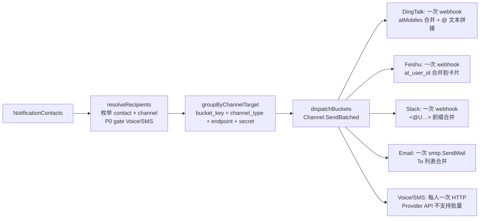
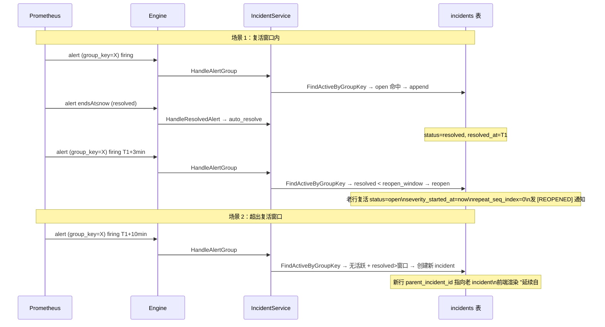

# 告警生命周期与收敛策略（v3）

v3 在 v2 的状态机基础上，把"收敛 / 复活 / 升级 / 多通道"四件事一次性沉到 incident
lifecycle 里，并彻底下线了过去基于独立 `escalation_policies` 表 + 后台 escalator
goroutine 的旁路升级链。整套策略围绕**四个设计目标 ↔ 四套机制**展开，全部由
`SystemConfig` 在 "设置 → 告警生命周期" 页面热修改，无需重启服务。

| 设计目标 | 待解决的运营问题 | v3 落地机制 |
| --- | --- | --- |
| 持续可见性（节奏可调） | open 状态 incident 在长时 firing 期内仅靠首次通知，运维易遗忘；固定 30 min 节奏要么吵要么慢 | **线性递增重发序列** `notification.repeat_schedule.interval_sequence_minutes` —— 默认 `[1, 3, 5]`，序列耗尽后按 `interval_step_minutes`（默认 2）继续递增，并以 `interval_max_minutes`（默认 30）封顶；序列下标 `repeat_seq_index` 持久化在 `incidents` 行上，每次升级 severity 自动归零，新档位再次回到密集头部 |
| 升级语义（驻留时长触发） | v2 既有 `schedule.escalate` 又有独立 `escalation_policies`，两套升级链状态分裂；按"自 opened 起累计时长"升级会与 reopen / append 行为耦合 | **dwell 驱动的 severity_chain** —— 每个档位声明 `severity` + `dwell` + `tag`；当 `time.Since(severity_started_at) ≥ dwell` 时升一级，并把 `severity_started_at` 重写为 `now()`、`repeat_seq_index` 归零；P0 档位 `dwell = null`，作为终态不再升级 |
| 多通道触达（P0 强约束） | P0 故障必须电话叫醒值班，但通知策略里勾选电话/短信容易在 P3/P2 误用 | **dispatcher 层硬编码** —— Voice / SMS 仅在 `incident.severity == "P0"` 时分发，与 `NotificationPolicy.severities` 解耦；IM (DingTalk/Feishu/Slack) 与 Email 仍走通知策略路由 |
| 高频重发的成本控制 | 多名 oncall 同处一个钉群、共用一个 SMTP 收件域时，每人一封邮件 / 每人一条 webhook 会放大 N 倍 | **dispatcher 三段式批量化** —— `resolveRecipients → groupByChannelTarget → dispatchBuckets`：相同 webhook URL + secret 的钉钉/飞书 contacts 合并为一次 webhook（@ 一并塞进 `atMobiles` / `at_user_id`），同 SMTP provider 的邮箱合并为一次 `smtp.SendMail`（多 To） |

> 同时保留 v2 已稳定的两个机制：双通道 auto-resolve（`endsat_signal` + `staleness`）
> 与 reopen 窗口（`incident.reopen_window` 默认 5 min，超窗则新建 incident 并通过
> `parent_incident_id` 链接历史）。本节后续的时间轴、状态图、复活示意均沿用 v2
> 描述（保持原行为），重点变化集中在重发节奏、升级触发与分发批量化。

## 整体时间轴（默认参数：`[1,3,5]` / step=2 / max=30 / dwell=1h）

```mermaid
gantt
    title Incident 生命周期（v3 默认参数 · 单位 min）
    dateFormat mm
    axisFormat %M
    section P3 阶段 (dwell 60min)
    创建 + 首次通知 (P3)        :milestone, m1, 00, 0min
    +1min [REPEAT]               :milestone, m2, 01, 0min
    +3min [REPEAT]               :milestone, m3, 04, 0min
    +5min [REPEAT]               :milestone, m4, 09, 0min
    +7min [REPEAT] (5+step)      :milestone, m5, 16, 0min
    +9min [REPEAT] (5+2·step)    :milestone, m6, 25, 0min
    持续 append + 序列重发        :a1, 00, 60min
    section 60min: 升级 P3→P2 (seq_index 归零)
    [ATTENTION] + 升级到 P2      :milestone, m7, 60, 0min
    再次 1/3/5/7/9 …             :a2, 60, 60min
    section 120min: 升级 P2→P1
    [ATTENTION] + 升级到 P1      :milestone, m8, 120, 0min
    section 180min: 升级 P1→P0 (终态)
    [CRITICAL] + 升级到 P0        :crit, milestone, m9, 180, 0min
    P0 触发 IM+Email+Voice+SMS    :a3, 180, 60min
    section 任意时刻
    上游 endsAt → auto_resolve    :crit, milestone, mr, 35, 0min
    无新告警>staleness_timeout    :crit, milestone, ms, 70, 0min
    resolved 5min 内复发 → reopen :crit, milestone, rp, 73, 0min
```



## 升级与重发的状态机



## 默认参数与可调项（SystemConfig）

`notification.repeat_schedule` 在 v3 由 v2 的扁平数组改为对象，schema 版本号显式
声明为 `3`；老的 v2 数组若残留会被 service.go 探测、记 warning 并退化为"不重发"，
避免误用：

```json
{
  "version": 3,
  "interval_sequence_minutes": [1, 3, 5],
  "interval_step_minutes": 2,
  "interval_max_minutes": 30,
  "severity_chain": [
    {"severity": "P3", "dwell": "1h",  "tag": "[REPEAT]"},
    {"severity": "P2", "dwell": "1h",  "tag": "[ATTENTION]"},
    {"severity": "P1", "dwell": "1h",  "tag": "[ATTENTION]"},
    {"severity": "P0", "dwell": null,  "tag": "[CRITICAL]"}
  ]
}
```

| Key | 默认 | 含义 |
| --- | --- | --- |
| `notification.repeat_schedule.interval_sequence_minutes` | `[1, 3, 5]` | 进入新 severity 后前 N 次重发的密集头部；按 `repeat_seq_index` 顺序消费 |
| `notification.repeat_schedule.interval_step_minutes` | `2` | 序列耗尽后每次再增加的步长（线性，不指数）|
| `notification.repeat_schedule.interval_max_minutes` | `30` | 计算出的下次间隔上限；防止冷却到几小时一次 |
| `notification.repeat_schedule.severity_chain[].dwell` | `1h`（P3/P2/P1）/ `null`（P0） | 当前 severity 的驻留时长，到点升一级；`null` 表示终态 |
| `notification.repeat_schedule.severity_chain[].tag` | `[REPEAT]` / `[ATTENTION]` / `[CRITICAL]` | 渲染到通知标题的前缀，便于值班一眼分辨阶段 |
| `incident.staleness_timeout` | `10m` | open/ack 超过窗口未收到新告警 → reaper 自动 resolve（用于 Kafka/OpenSearch/通用 Webhook 等无 endsAt 源） |
| `incident.reopen_window` | `5m` | 已 resolved 在窗口内复发 → 复活原 incident 并发 `[REOPENED]`；超窗则建新 incident 并写 `parent_incident_id` |
| `notification.voice` | `{}` | Voice provider 配置（`provider_url` / `auth_header` / `caller_id`）；缺省时 P0 不发起电话呼叫 |
| `notification.sms` | `{}` | SMS provider 配置（`provider_url` / `auth_header` / `sign_name` / `template_code`）；缺省时 P0 不发短信 |

## 默认通知矩阵（dispatcher 层语义）

| 严重级 | IM (DingTalk/Feishu/Slack) | Email | Voice 电话 | SMS 短信 |
| :---: | :---: | :---: | :---: | :---: |
| P0 | ✓ | ✓ | ✓（硬编码）| ✓（硬编码）|
| P1 | ✓ | ✓ | — | — |
| P2 | ✓ | ✓ | — | — |
| P3 | ✓ | ✓ | — | — |

- IM / Email：按 `NotificationPolicy.severities` 路由，dispatcher 自动按 channel
  target 合并多人；
- Voice / SMS：dispatcher 在 `resolveRecipients` 阶段以 `severity == "P0"` 为唯一
  开关，**忽略通知策略 severities 的其它勾选**，避免 P3/P2 误叫醒；
- 联系人需在通知对象里填写手机号（Voice/SMS 走 `Mention` 字段），系统侧需在系统
  设置中配置 voice/sms provider 才会真正发出。

## 批量化分发语义



- bucket_key 设计：钉钉/飞书 = `webhook_url + secret`；Slack = `webhook_url`；
  Email = `smtp_host + smtp_port + from`；Voice / SMS = `provider_url`（但仍按
  收件人逐条 HTTP，因为 provider API 不允许多号同请求）。
- `notification_log` 仍按 `(incident_id, contact_id, channel)` 一条一行写入，便于
  审计与去重；批量化只发生在出站请求层面。

## v2 → v3 兼容性 / 废弃说明

| 项 | v3 状态 | 说明 |
| --- | --- | --- |
| `escalation_policies` 表 | **DEPRECATED** | migration `000046_retire_escalation_policies` 把默认三条 `is_enabled = FALSE`，并在表 / 行注释打 `DEPRECATED` 标签；表本身保留以便审计回查 |
| `incident.StartEscalator` 后台 goroutine | **删除** | `cmd/alertmesh/main.go` 不再启动；`internal/incident/escalator.go` 与 `internal/engine/escalation.go` 已删除 |
| `engine/pipeline.go` `loadEscalations` / `Pipeline.escalator` | **删除** | 升级链全部改由 `service.go::maybeRepeatNotify` 在 incident lifecycle 内完成 |
| `notification.repeat_schedule` v2 数组 schema | **运行期检测 + warning** | service.go 解析时若发现 `version != 3` / 顶层不是 object，会日志 warn 并禁用重发；运维需进入 "设置 → 告警生命周期" 重新保存以触发热加载 |
| 老的 `incident.RepeatSeqIndex` 与 `severity_started_at` 列 | **新增** | migration `000045_repeat_schedule_v3` 加列并把 `severity_started_at` 回填为 `opened_at`；老 incident 升级时把回填值视为 dwell anchor，行为平滑过渡 |

## 复活 vs 新建：判定示意



## Prometheus 指标

| 指标 | 标签 | 用途 |
| --- | --- | --- |
| `alertmesh_incidents_auto_resolved_total` | `reason ∈ {endsat_signal, staleness}` | 区分上游 endsAt 自动恢复 vs reaper 兜底 |
| `alertmesh_incidents_reopened_total` | — | 复活窗口命中次数；过高说明阈值偏小 |
| `alertmesh_incident_repeat_notifications_total` | `tag ∈ {[REPEAT], [ATTENTION], [CRITICAL]}` | 各档位重发命中次数；`[CRITICAL]` 单独成列以观察 P0 噪音 |
| `alertmesh_incident_repeat_sequence_step` | `severity` | Histogram：每次重发触发时的 `repeat_seq_index`；P95 高说明该 severity dwell 偏长，应下调 |
| `alertmesh_incidents_escalated_total` | `from`, `to` | 由 dwell-driven `escalateAndReset` 触发的升级（v3 仅此一种来源）|
| `alertmesh_notifications_dispatched_total` | `channel`, `batched ∈ {true, false}` | 出站调用次数；`batched=true` 占比越高说明同 bucket 合并越有效 |
