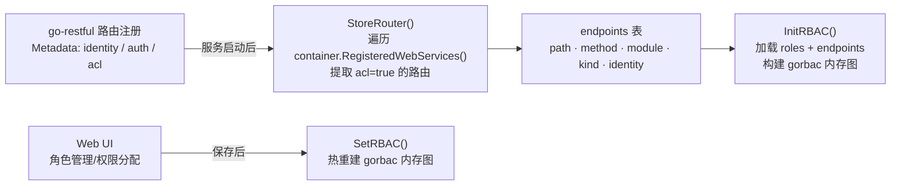
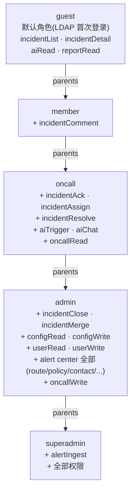
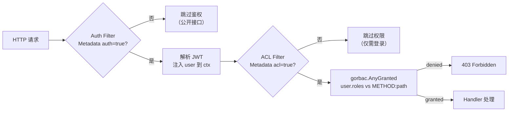
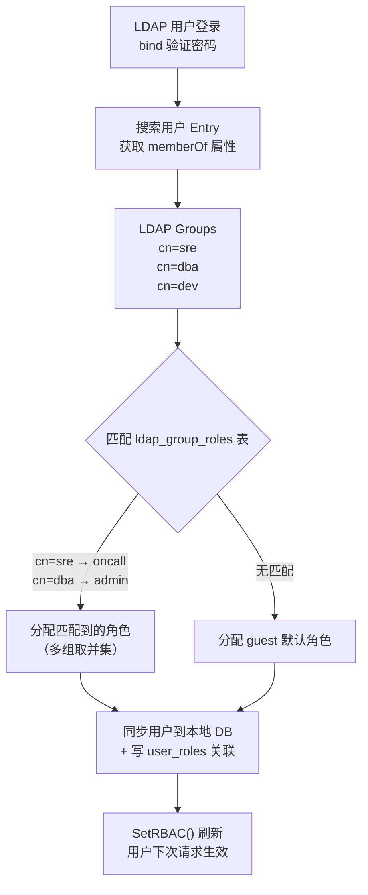
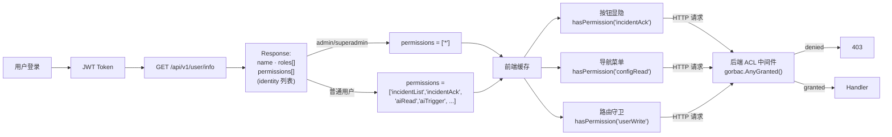

# 权限模型 (RBAC)

> 本文档对应原 README §5。使用 [gorbac](https://github.com/mikespook/gorbac)，
> 参考 devcloud 的 Endpoint 自动同步 + `METHOD:path` 运行时匹配方案。

> **核心原则：接口权限即按钮权限。** 每个受保护 API 路由在注册时声明一个
> **identity**（如 `incidentAck`），服务启动后自动同步到 `endpoints` 表。角色
> 通过多对多关联 endpoint，gorbac 在运行时以 `METHOD:path` 作为 permission flag
> 校验。前端从 `/api/v1/user/info` 获取用户拥有的 identity 列表，按钮/菜单/路由
> 守卫复用同一套 identity，**无需单独维护菜单或按钮权限表**。

## 1. Endpoint 模型与自动同步



**Endpoint GORM 模型**：

```go
type Endpoint struct {
    Path     string `gorm:"type:varchar(255);uniqueIndex:idx_path_method"`
    Method   string `gorm:"type:varchar(10);uniqueIndex:idx_path_method"`
    Module   string `gorm:"type:varchar(64)"`                                // 模块：告警管理 / AI / 系统管理
    Kind     string `gorm:"type:varchar(64)"`                                // 子类别：Incident / 配置 / 用户
    Identity string `gorm:"type:varchar(64);primaryKey"`                     // 唯一标识，go-restful 元数据声明
    Remark   string `gorm:"type:varchar(255)"`                               // 接口描述（来自 route.Doc）
}
```

**自动同步**（`StoreRouter`）：服务启动后遍历所有 go-restful WebService 路由，
将标记了 `acl=true` 的路由 upsert 到 `endpoints` 表，**无需手动维护接口清单**。
具体实现见 [`internal/router/router.go`](../internal/router/router.go)。

## 2. Identity 常量（`internal/label/` 包）

所有 identity 定义在 `internal/label/` 包中，按模块分文件，**camelCase** 命名。
按模块分组：

- **告警管理**（`label/incident.go`）：`incidentList` / `incidentDetail` /
  `incidentAck` / `incidentAssign` / `incidentComment` / `incidentResolve` /
  `incidentClose` / `incidentMerge`
- **AI 分析**（`label/ai.go`）：`aiRead` / `aiTrigger` / `aiChat` /
  `llmProviderList` / `llmProviderCreate` / `llmProviderUpdate` /
  `llmProviderDelete` / `llmProviderDefault` / `llmProviderTest`
- **系统管理**（`label/system.go`）：`configRead` / `configWrite` / `userRead` /
  `userWrite` / `oncallRead` / `oncallWrite` / `reportRead`
- **告警接入**（`label/alert.go`）：`alertIngest`（不走用户 JWT/RBAC，详见
  [data-sources.md](data-sources.md)）
- **告警中心**（`label/alert_center.go`）：`alertRoute*` / `policy*` / `contact*` /
  `contactGroup*` / `aggregation*` / `silence*` / `inhibit*` / `escalation*` /
  `template*` / `webhookSource*`（`channel*` 已删除，整条 `notification_channels`
  路径下线）

## 3. 路由注册声明权限

go-restful 路由注册时通过 `Metadata` 声明 identity、auth、acl：

```go
ws.Route(ws.POST("/{id}/ack").
    To(handler.AckIncident).
    Doc("确认 Incident").
    Metadata(label.MetaIdentity, label.IncidentAck).
    Metadata(label.MetaModule, label.IncidentModuleName).
    Metadata(label.MetaKind, "Incident").
    Metadata(label.MetaAuth, label.Enable).
    Metadata(label.MetaACL, label.Enable))
```

## 4. Identity → API → 前端按钮 完整映射

| Identity | Method + Path | 前端按钮/菜单 |
|----------|-------------|--------------|
| `alertIngest` | `POST /api/v1/alerts/*` | — (不走用户 JWT/RBAC，鉴权在路由层独立处理：AM/Prom 无鉴权 + Webhook 强制 RFC 9421) |
| `incidentList` | `GET /api/v1/incidents` | 告警列表页 |
| `incidentDetail` | `GET /api/v1/incidents/{id}` | Incident 详情页 |
| `incidentAck` | `POST /api/v1/incidents/{id}/ack` | "确认" 按钮 |
| `incidentAssign` | `POST /api/v1/incidents/{id}/assign` | "分配" 按钮 |
| `incidentComment` | `POST /api/v1/incidents/{id}/comments` | "评论" 按钮 |
| `incidentResolve` | `POST /api/v1/incidents/{id}/resolve` | "标记解决" 按钮 |
| `incidentClose` | `POST /api/v1/incidents/{id}/close` | "关闭" 按钮 |
| `incidentMerge` | `POST /api/v1/incidents/{id}/merge` | "合并" 按钮 |
| `aiRead` | `GET /api/v1/incidents/{id}/ai` | AI 报告面板 |
| `aiTrigger` | `POST /api/v1/incidents/{id}/ai/trigger` | "触发 AI" 按钮 |
| `aiChat` | `POST /api/v1/incidents/{id}/ai/chat` | "追问" 输入框 |
| `configRead` | `GET /api/v1/configs/*` | 系统配置菜单 |
| `configWrite` | `PUT /api/v1/configs/*` | 配置保存按钮 |
| `userRead` | `GET /api/v1/users` | 用户管理菜单 |
| `userWrite` | `POST/PUT/DELETE /api/v1/users` | 用户编辑按钮 |
| `oncallRead` | `GET /api/v1/oncall` | 排班页面 |
| `oncallWrite` | `PUT /api/v1/oncall` | 排班编辑 |
| `reportRead` | `GET /api/v1/reports/*` | 报表菜单 |
| `alertRoute{List,Create,Update,Delete}` | `… /api/v1/alert/routes[/{id}]` | 告警路由策略页 |
| `policy{List,Create,Update,Delete}` | `… /api/v1/alert/policies[/{id}]` | 通知策略页 |
| `contact{List,Create,Update,Delete}` | `… /api/v1/alert/contacts[/{id}]` | 联系人页 |
| `contactGroup{List,Create,Update,Delete}` | `… /api/v1/alert/contact-groups[/{id}]` | 联系人组页 |
| `aggregation{List,Create,Update,Delete}` | `… /api/v1/alert/aggregations[/{id}]` | 告警聚合策略页 |
| `silence{List,Create,Delete}` | `… /api/v1/alert/silences[/{id}]` | 告警静默策略页 |
| `inhibit{List,Create,Update,Delete}` | `… /api/v1/alert/inhibits[/{id}]` | 告警抑制策略页 |
| `escalation{List,Create,Update,Delete}` | `… /api/v1/alert/escalations[/{id}]` | 告警升级策略页 |
| `template{List,Create,Update,Delete}` | `… /api/v1/alert/templates[/{id}]` | 通知消息模板页 |
| ~~`channel{List,Create,Update,Delete}`~~ | ~~`… /api/v1/alert/channels[/{id}]`~~ | **已废弃**，路由 + handler + 表均已下线；用通知策略 + 联系人取代 |
| `webhookSource{List,Create,Update,Delete,Rotate}` | `… /api/v1/alert/webhook-sources[/{id}[/rotate]]` | Webhook 可信源页 |
| `llmProvider{List,Create,Update,Delete,Default,Test}` | `… /api/v1/llm-providers[/{id}[/set-default\|/test]]` | 系统管理 → AI 大模型配置（仅管理员）|

## 5. 角色继承与 gorbac 构建



**角色表**：角色通过 `parents` 字段声明继承，关联 endpoint 通过 `role_endpoints`
多对多表。`InitRBAC` / `SetRBAC` 启动时或角色变更后重建 gorbac 内存图，详细
实现见 [`internal/auth/rbac.go`](../internal/auth/rbac.go)。

## 6. Auth + ACL 中间件

两个中间件按顺序注册到 go-restful Container Filter：



> **路径匹配**：gorbac 的 permission 比较是精确字符串匹配。由于 go-restful
> 的 `SelectedRoute().Path()` 返回的是注册时的路径模板（如
> `/api/v1/incidents/{id}/ack`），而 endpoint 表中存储的也是同一模板路径，因此
> 天然匹配，无需额外正则。

实现见 [`internal/router/middleware/auth.go`](../internal/router/middleware/auth.go)
与 [`internal/router/middleware/acl.go`](../internal/router/middleware/acl.go)。

## 7. LDAP 组映射角色

LDAP 用户认证后，通过 `memberOf` 属性获取其所属 LDAP Group，匹配
`ldap_group_roles` 映射表自动分配角色。未匹配到任何组的用户默认分配 `guest`
角色。



**多组场景**：用户属于多个 LDAP Group 且匹配到多个角色时，取**所有匹配角色**
（通过 `user_roles` 多对多关联）。gorbac 的 `AnyGranted` 会检查用户所有角色，
任一角色拥有权限即放行。LDAP 配置中新增的 group 相关参数（Web UI 填写入库）
见 [`internal/model/system.go`](../internal/model/system.go) `LDAPConfig`。

## 8. 前端统一权限流程



```typescript
// 前端 permission.ts
const hasPermission = (perm: string): boolean => {
  const { permissions } = useCurrentUser()
  if (permissions.includes('*')) return true  // admin 全权限
  return permissions.includes(perm)
}

// 按钮直接复用 identity
<Button onClick={ack} disabled={!hasPermission('incidentAck')}>确认</Button>
<Button onClick={triggerAI} hidden={!hasPermission('aiTrigger')}>AI 分析</Button>
```

**前后端双重校验**：前端用 identity 控制 UI 显隐，后端用 `METHOD:path` 保障
安全，二者通过 endpoint 表的 identity ↔ path 映射关联，同一份数据来源。
